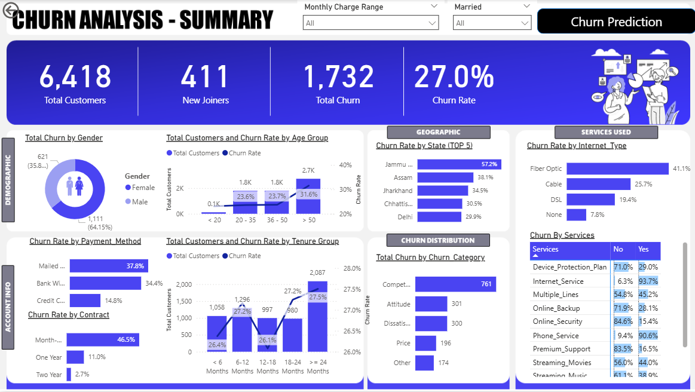
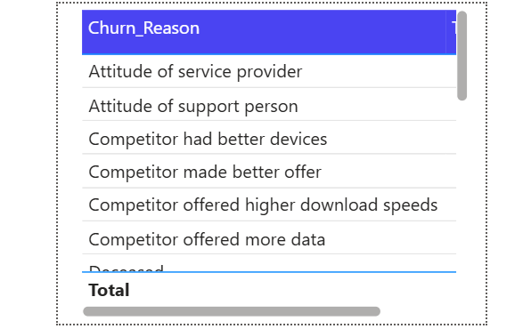
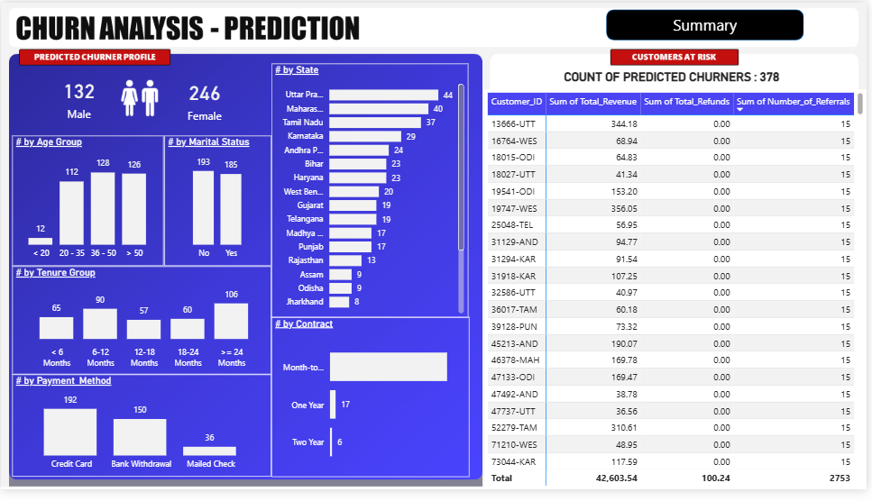

# 📉 Customer Churn Analytics Pipeline


An end-to-end customer churn analytics pipeline that combines **SQL Server**, **Python Machine Learning**, and **Power BI** to analyze customer behavior, identify churn drivers, and predict customers at risk of leaving.

---

## 📊 Dashboard Preview

### Churn Analysis Summary


### Churn Reason


### Churn Prediction Dashboard


---

## 📌 Problem Statement

Customer retention is a major challenge in the telecom industry — acquiring a new customer costs **5–7x more** than retaining an existing one. This project builds a complete analytics pipeline that transforms raw customer data into actionable business insights and churn predictions.

**Three key business questions answered:**
1. **Who** is churning?
2. **Why** are customers churning?
3. **Which customers** are most likely to churn in the future?

---

## 🔄 Pipeline Architecture

```
Raw Telecom Customer Data (7,043 customers)
              │
              ▼
     SQL Server (SSMS)
  ETL · Null Handling · Staging → Production Tables · Views
              │
              ▼
         Power BI
  Transformations · DAX Measures · Interactive Dashboard
              │
              ▼
   Python — Random Forest Classifier
  Training · Evaluation · Prediction on New Customers
              │
              ▼
  Predictions CSV → Power BI Churn Prediction Page
```

---

## 🛠️ Tech Stack

| Component | Technology |
|---|---|
| Database | SQL Server |
| Query Language | T-SQL |
| Data Processing | SQL ETL (staging → production pattern) |
| Machine Learning | Python (scikit-learn) |
| ML Libraries | Pandas, NumPy, Scikit-Learn, Joblib, Matplotlib, Seaborn |
| Visualization | Power BI (DAX, Power Query) |
| Version Control | Git & GitHub |

---

## 🗂️ Project Structure

```
customer-churn-analytics-pipeline/
│
├── README.md
├── requirements.txt
├── .gitignore
│
├── data/
│   ├── raw/                        # Original telecom dataset
│   ├── processed/                  # Cleaned data + ML predictions
│   └── sample/                     # 100-row sample for quick preview
│
├── sql/
│   ├── 01_create_database.sql      # Database + staging table setup
│   ├── 02_data_exploration.sql     # Distribution queries
│   ├── 03_null_analysis.sql        # Null count across all columns
│   ├── 04_data_cleaning.sql        # ISNULL handling → prod_Churn
│   └── 05_create_views.sql         # vw_ChurnData & vw_JoinData
│
├── notebooks/
│   └── churn_prediction.ipynb      # End-to-end ML walkthrough with visuals
│
├── src/
│   ├── preprocessing.py            # Data cleaning functions
│   ├── feature_engineering.py      # Encoding & feature creation
│   ├── train_model.py              # Model training & saving
│   ├── predict_churn.py            # Prediction on new customers
│   └── utils.py                    # Shared helper functions
│
├── models/
│   ├── random_forest_model.pkl     # Saved trained model
│   └── label_encoders.pkl          # Saved encoders for inference
│
├── powerbi/
│   └── Customer_Churn_Dashboard.pbix
│
└── reports/
    └── screenshots/
        ├── Churn_Prediction.png
        ├── Churn_Reason.png
        └── Summary.png
```

---

## 🗄️ SQL Workflow

The SQL layer handles the full data engineering process:

| Script | Purpose |
|---|---|
| `01_create_database.sql` | Database creation and raw data import |
| `02_data_exploration.sql` | Distribution analysis by gender, contract, state, status |
| `03_null_analysis.sql` | Null count across all 30+ columns |
| `04_data_cleaning.sql` | ISNULL handling, type casting, insert into `prod_Churn` |
| `05_create_views.sql` | `vw_ChurnData` (existing customers) + `vw_JoinData` (new joiners) |

---

## 📈 Power BI Dashboard

**Pages:**
- **Summary Page** — full churn overview with KPI cards, demographic breakdown, and service analysis
- **Churn Reason Page** — tooltip-driven breakdown of churn categories and specific reasons
- **Prediction Page** — visualization of ML-predicted at-risk customers

**Key KPIs:**

| Metric | Value |
|---|---|
| Total Customers | 7,043 |
| Total Churn | ~1,900 |
| Churn Rate | ~27% |
| New Joiners | tracked separately |

---

## 🤖 Machine Learning Model

**Algorithm:** Random Forest Classifier

### Configuration

| Parameter | Value |
|---|---|
| n_estimators | 100 |
| random_state | 42 |
| Train / Test Split | 80% / 20% |

### Performance

| Metric | Score |
|---|---|
| Accuracy | 84% |
| Precision | 78% |
| Recall | 65% |
| F1 Score | 71% |

---

## 🔍 Key Business Insights

| Finding | Recommended Action |
|---|---|
| ~27% overall churn rate | Set baseline retention target |
| Month-to-month contracts churn most | Incentivize annual contract upgrades |
| Short tenure (< 6 months) = highest risk | Trigger early onboarding retention campaigns |
| Fiber Optic users churn more than DSL | Investigate service quality & pricing |
| No Online Security/Tech Support → higher churn | Bundle these services as default |
| Competitors & pricing are top churn reasons | Introduce loyalty pricing tiers |

---

## ⚙️ How to Run

### 1. Clone Repository
```bash
git clone https://github.com/Arushikhare6/customer-churn-analytics-pipeline.git
cd customer-churn-analytics-pipeline
```

### 2. Install Dependencies
```bash
pip install -r requirements.txt
```

### 3. Database Setup
Run SQL scripts in order inside SSMS:
```
01_create_database.sql → 02_data_exploration.sql → 03_null_analysis.sql
→ 04_data_cleaning.sql → 05_create_views.sql
```

### 4. Train Model
```bash
python src/train_model.py
```

### 5. Generate Predictions
```bash
python src/predict_churn.py
```

### 6. Open Power BI Dashboard
Open `powerbi/Churn Analysis.pbix` in Power BI Desktop and refresh the data source connection.

---

## 🚀 Future Improvements

- Hyperparameter tuning with GridSearchCV
- XGBoost model comparison
- Automated ETL pipeline scheduling
- Cloud deployment on Azure

---

## 📄 License

This project is licensed under the MIT License.
